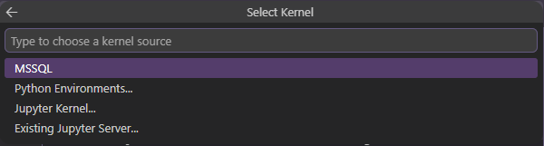
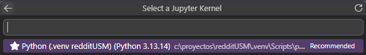

# 📊 RedditUSM 🎓

> Sistema de minería de datos y análisis de opiniones sobre la Universidad Técnica Federico Santa María a partir de publicaciones en Reddit. Desarrollado en un entorno de desarrollo raíz (`dev`).

---

## 📋 Descripción del Proyecto
**RedditUSM** es un proyecto enfocado en el análisis de opiniones y percepciones de la comunidad estudiantil de la Universidad Técnica Federico Santa María (UTFSM) utilizando el corpus histórico de Reddit. 

El objetivo principal es construir un pipeline de minería de datos y procesamiento de lenguaje natural (NLP) capaz de transformar texto no estructurado en información interpretable. De esta forma, se provee un diagnóstico cuantitativo y representativo sobre las principales preocupaciones, dolores institucionales y el estado de la salud mental de los estudiantes a lo largo del año académico.

---

## 🛠️ Arquitectura del Pipeline (Ciclo CRISP-DM)

El desarrollo de **RedditUSM** se estructuró siguiendo las etapas del ciclo de vida estándar en minería de datos:

### 1. Extracción de Datos (Ingesta Histórica via PullPush)
* Ingesta de datos masiva utilizando la API **PullPush**, permitiendo la recuperación exhaustiva de hilos y comentarios históricos sin las limitaciones de volumen de la API oficial de Reddit.
* Extracción dirigida de hilos históricos en comunidades asociadas a la educación superior chilena, filtrando mediante heurísticas de palabras clave institucionales ("UTFSM", "Sansano", etc.).

### 2. Preprocesamiento y Limpieza de Texto
* Normalización léxica: Conversión a minúsculas, eliminación de caracteres especiales, URLs y emojis redundantes.
* Remoción de *Stopwords* genéricas y filtrado de ruido semántico (ej. nombres propios redundantes).
* Formateo seguro de variables temporales (`created_utc`) a la zona horaria de Chile (UTC-4).

### 3. Clasificación de Sentimientos
* Implementación del modelo preentrenado `Pysentimiento` (arquitectura BERT optimizada para español).
* Clasificación de publicaciones en tres categorías semánticas: `negative`, `neutral` y `positive`.

### 4. Modelado Temático (Clustering Dirigido)
Para evitar la abstracción inútil de algoritmos puros como K-Means sobre componentes PCA, se optó por un **Modelado Dirigido mediante Reglas Semánticas**, aislando los macrotemas críticos de la vida universitaria:
* **Ramos, Docencia y Certámenes:** Discusión sobre evaluaciones, pautas y profesores.
* **Bienestar, Becas y Casino:** Estado de la beca BAES/Pluxee, infraestructura y alimentación.
* **Salud Mental y Carga Emocional:** Gestión del estrés, ansiedad y fatiga académica.
* **Comunidad y Varios:** Anécdotas, memes, hilos lúdicos e interacción social informal.
* **Logros y Experiencias Positivas:** Felicitaciones, superación de ramos y egresos.

### 5. Evaluación de Impacto y Respuesta Comunitaria
En lugar de depender de matrices de confusión abstractas basadas en Inteligencia Artificial (Precision, Recall), la validación se enfocó en un **Análisis Empírico de Impacto Social**, evaluando cómo reacciona la comunidad frente a cada problemática mediante métricas humanas reales:
* **Índice de Empatía Social:** Medido a través del promedio de votos a favor (`score` / upvotes) por publicación.
* **Índice de Debate Comunitario:** Medido a través del volumen promedio de comentarios y respuestas por hilo de discusión.

---

## 📈 Visualizaciones y Hallazgos Clave

* **Evolución Histórica (Pre-pandemia, Clases Online y Post-pandemia):** Línea de tiempo que evidencia un alza crítica durante la virtualidad, masificándose las quejas sobre estrés y ramos, mientras colaron en caída libre las consultas de admisión.
* **El Termómetro del Trasnoche:** Análisis horario que revela que la negatividad no se intensifica necesariamente en la madrugada, aunque sí expone una notoria cantidad de alumnos activos publicando a altas horas de la noche.
* **Línea de Tiempo Anual de la Frustración:** Muestra que, a diferencia de la hipótesis inicial que apuntaba al final de los dos semestres, el desahogo negativo alcanza su pico real durante el periodo de los primeros certámenes del año, y vuelve a dispararse en noviembre con el cierre general.

---

## 🗂️ Estructura del Repositorio

```text
REDDITUSM/
├── data/
│   ├── processed/         # CSVs finales filtrados y etiquetados
│   └── raw/               # CSV de prueba
├── notebooks/
│   └── USM_Sentiment_Analysis.ipynb   # Entorno interactivo y gráficos
├── results/
│   └── figures/           # Gráficos estáticos exportados
├── src/                   # Código fuente modular
│   ├── analytics/         # Estadísticas y métricas de sentimiento
│   ├── data/              # Caché y almacenamiento de consultas
│   ├── scraper/           # Ingesta asíncrona (PullPush)
│   ├── search/            # Motor de búsquedas internas
│   ├── analysis.py        # Orquestador exploratorio
│   ├── app.py             # Dashboard (Streamlit)
│   ├── classifier.py      # Lógica de modelos supervisados
│   ├── config.py          # Variables globales
│   ├── main.py            # Script ejecutor del pipeline en src
│   ├── preprocess.py      # Limpieza léxica y temporal
│   ├── reddit_search.py   # Consultas complementarias
│   ├── scraper.py         # Módulo base de extracción
│   ├── sentiment.py       # Clasificador transformer
│   ├── topics.py          # Reglas para modelado de tópicos
│   └── visualize.py       # Renderizado de gráficos de impacto
├── .gitignore             # Exclusión de archivos locales
├── main.py                # Ejecutor raíz del sistema completo
├── README.md              # Documentación
└── requirements.txt       # Dependencias
```

## ⚙️ Instalación y Uso Paso a Paso (Simulación de Entorno)

Sigue estos pasos exactos para clonar, configurar y ejecutar el proyecto localmente en tu editor de código:

### 1. Abrir tu Editor de Código
* Abre **Visual Studio Code** (o tu IDE de preferencia).
* Abre una nueva ventana de la **Terminal** (`Ctrl + Shift + ñ` o a través del menú superior `Terminal -> New Terminal`).

### 2. Clonar el Repositorio y Entrar al Proyecto
Copia y pega el siguiente comando en la terminal que acabas de abrir para descargar el proyecto e ingresar a su directorio raíz:
```bash
git clone https://github.com/andreavalfonzo/RedditUSM.git
```
```bash
cd RedditUSM
```
```bash
code .
```
Luego de haber ejecutado la ultima línea, esta te abrirá una nueva ventana en la que estrás trabajando en tu proyecto ```Reddit```.
Luego abre la carpeta `notebooks` y seleccionas el archivo `USM_Sentiment_Analysis.ipynb`. Abre la terminal con el comando `Ctrl + Shift + ñ`, y muévete inmediatamente a la rama de desarrollo para asegurar el entorno de trabajo correcto:
```bash
git checkout dev
```
Crea y activa el entorno virtual aislado para evitar conflictos con otras librerías del sistema (comandos para Windows):
```bash
python -m venv .venv
```
```bash
.venv\Scripts\activate
```
_(Sabrás que funcionó porque aparecerá el prefijo (.venv) al inicio de tu línea de comandos)._

Luego instala de golpe todas las dependencias necesarias del proyecto utilizando el archivo de requisitos (este paso puede demorar un poco):
```bash
pip install -r requirements.txt
```
Luego de que se hayan instalado todas las dependencias, dale a `play` a la primera celda, esta te redirigirá a la selección de un entorno en la parte superior del Visual Studio Code.



Vas a seleccionar la opción de `Jupyter Kernel`.



Luego seleccionas la opción creada en el entorno `venv` (normalmente es el que tiene el símbolo de estrella). Y finalmente puedes correr todas las celdas y ejecutar el proyecto de forma continua y sin errores.